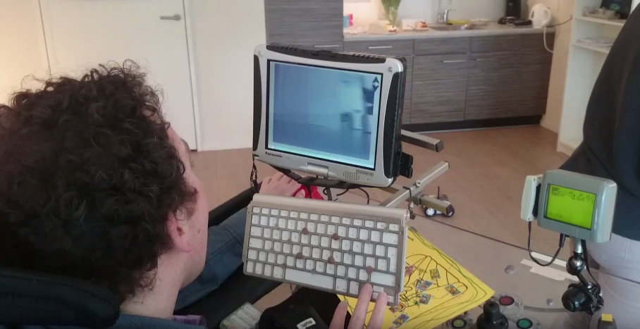

# KiepProjects
### Starting point for all Kiep related projects
The Kiep projects is a collection of tools created for our good friend Joost a.k.a. the Kiep. Joost suffered from an accident, making him unable to speak and limited body function. He has to communicate and interact with the world with 1 functioning arm and hand. Most of the tools are centered around the [Tobii Dynavox Communicator](http://www.tobiidynavox.com/) tool. Started with single button input a few years ago. Now using qwerty keyboard and a mouse, often in Windows, outside communicator tool.

Context:
 - Unable to talk
 - 1 functioning arm and hand
 - The functioning hand is very well developed, can make extreme gestures
 - Other arm and hand are completely non-functioning
 - Very limited control over legs and feet (wheelchair user)
 - Limited control over head motion (nodding is possible, but takes lot of effort)
 - Limited vision (one eye not usable and other eye limited usable)
 - Technical background
 - A Panasonic Toughbook running Windows 10 mounted on wheelchair
 - Fixed desktop PC with large 42" TV screen running Windows 10

## Active used and maintained
| Project | Description |
| --- | --- |
| [KiepTimer](https://github.com/Joozt/KiepTimer) | C# WPF application that shows a notification overlay at a given interval |
| [KiepRover](https://github.com/Joozt/KiepRover) | C# WPF application for CloudRover wifi RC car |
| [KiepLamp](https://github.com/Joozt/KiepLamp) | C# WPF application for switching devices and running scenes on Vera Z-wave controller |
| [KiepVisitorRegistration](https://github.com/Joozt/KiepVisitorRegistration) | C# WPF application for displaying a fullscreen visitor registration served from ASP.NET |
| [KiepAgendaViewer](https://github.com/Joozt/KiepAgendaViewer) | C# WPF application for displaying a fullscreen Google Calendar proxied through ASP.NET |
| [KiepAutoHotkey](https://github.com/Joozt/KiepAutoHotkey) | AutoHotkey scripts for use with Tobii Dynavox Communicator page sets |

## Under development
| Project | Description |
| --- | --- |
| [ABC-TTS](https://github.com/Joozt/ABC-TTS) | An alphabet reader Android app to form single words for Text-To-Speech, purely touch and audio based |

## Experiments
| Project | Description |
| --- | --- |
| [KiepLogClipboard](https://github.com/Joozt/KiepLogClipboard) | C# WPF program to download e-mail contents via clipboard |
| [KiepAlphabetScroller](https://github.com/Joozt/KiepAlphabetScroller) | C# WPF application that shows a large alphabet carousel overlay for text input |
| [KiepSimpleTalk](https://github.com/Joozt/KiepSimpleTalk) | C# WPF application for single button communication, using scanning pattern |

## Obsolete (no longer used and/or maintained)
| Project | Description |
| --- | --- |
| [KiepMissileLauncher](https://github.com/Joozt/KiepMissileLauncher) | C# WPF shell for USB Missile Launcher, that can be controlled with 2 buttons |
| [KiepEmailExport](https://github.com/Joozt/KiepEmailExport) | C# Forms application for downloading e-mail content from Gmail POP3 into HTML |
| [KiepPhotoDownloader](https://github.com/Joozt/KiepPhotoDownloader) | C# console application for downloading photos from Gmail via IMAP |
| [KiepTetris](https://github.com/Joozt/KiepTetris) | C# WPF version of Tetris that can be controlled by mouse or keyboard |
| [KiepMouseSpeed](https://github.com/Joozt/KiepMouseSpeed) | C++ application to change the Windows mouse speed by absolute or relative value |
| [KiepWebcam](https://github.com/Joozt/KiepWebcam) | C# WPF application that shows fullscreen single JPG webcam images |
| [KiepTeletext](https://github.com/Joozt/KiepTeletext) | C# WPF Viewer for the Dutch NOS teletext |
| [KiepCommunicationSoftware](https://github.com/Joozt/KiepCommunicationSoftware) | The first communication tools we created for Kiep |
